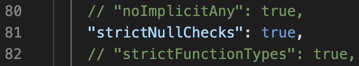

## Start your first Project

```
npm init -y

npx tsc -init
```

#### @tsconfig.json - active the 'strictNullChecks' attribute



## How to compile `.ts` file?
1. compile single `.ts` file

   ```node xxx.ts```

2. compile all `.ts` files under the project folder

   ```tsc```

## Type Inference & Annotation
### **What**: 推論與註記到底**為何**？
### **Where**: 到底**什麼地方**會用到推論與註記？
### **When**: 到底**什麼時候**會用到推論與註記？
### **Why**: **為何**我們要認識推論與註記的機制？
### **How**: **如何**善用推論與註記？

## The Types

### Primitive Types
- `number`
- `string`
- `boolean`
- `undefined`
- `null`
- `void` 

### Object Types
- 基礎物件型別：`JSON Object`, `Array`, `Instance`
- TypeScript 擴充型別：`Enum`, `Tuple`
- 函式型別 Function Types：`(Input) => (Output)`

### Object Literal Type
- 
```
var obj: { property: string; } = { property: "foo" };
```

### Special Type
- `any`, `never` (TS 2.0 Released)
- `unknow` (TS 3.0 Released)

### Compound Type
- union: `|`
- intersection: `&`

## 重點 1. 型別推論的目的 Purpose of Type Inference
- 讓`TypeScript`協助我們確保不會做錯事情 —— 也就是不小心把不同型別的東西丟到被推論過後的變數
  
## 重點 2. any 是造成型別混亂的根源
- `Nullable Types`會被推論為`any`型別，而`any`在`TypeScript`裡會無法監督變數狀態，造成程式碼的混亂。
- 避免變數的型別被視為`any`
  
## 重點 3. 遲滯性指派(Delayed Initialization)
- 每當我們對任何變數不立即指派值，該變數會無條件被視為 any 型別。
- 先定義變數後，不直接指派值，而是當程式碼執行到後面才開始指派。

## 重點 4. 對遲滯性指派進行型別註記
```
let A: T;

A = B as T;
```

## 重點 5. 型別註記的目的
- 讓開發者明確知道變數固定在哪個型別
- 避免使用`any`型別，增加debug困難

## 重點 6. 型別註記與推論 Type Annotation & Inference
- `TS`預設會把型別推論做得很好
- 如果對於型別不明確或者是會被推論為`any`狀態的變數，使用者要積極使用型別註記
- **型別推論**是`TS`自你開始寫程式碼的時候，它就會幫你監控了
- **型別註記**則是開發者必須手動宣告給`TS`看的


## Referrences
- [Day 01. 遠征 TypeScript・行前準備](https://ithelp.ithome.com.tw/articles/10214714)
- [Day 02. 前線維護・型別推論 X 註記 - Type Inference & Annotation](https://ithelp.ithome.com.tw/articles/10214719)